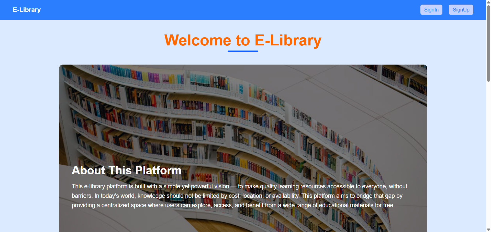
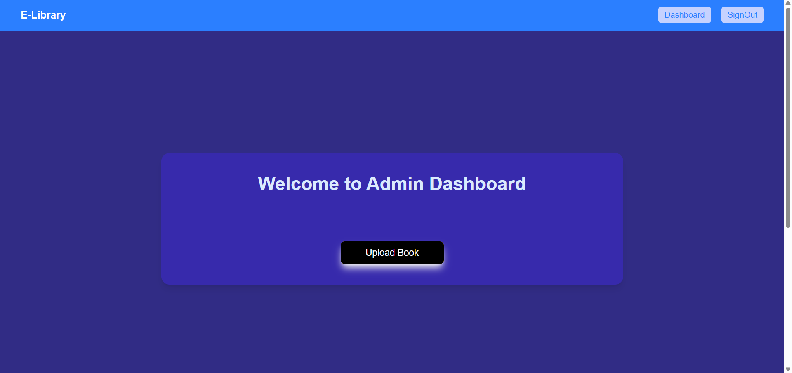
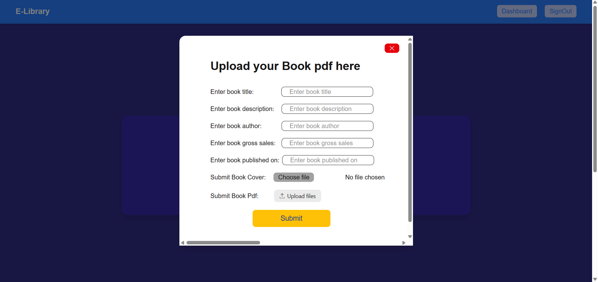
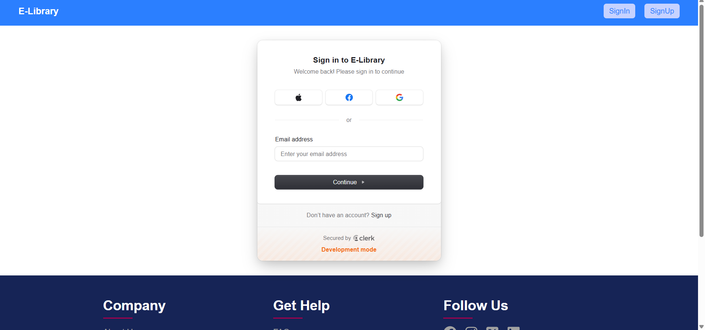
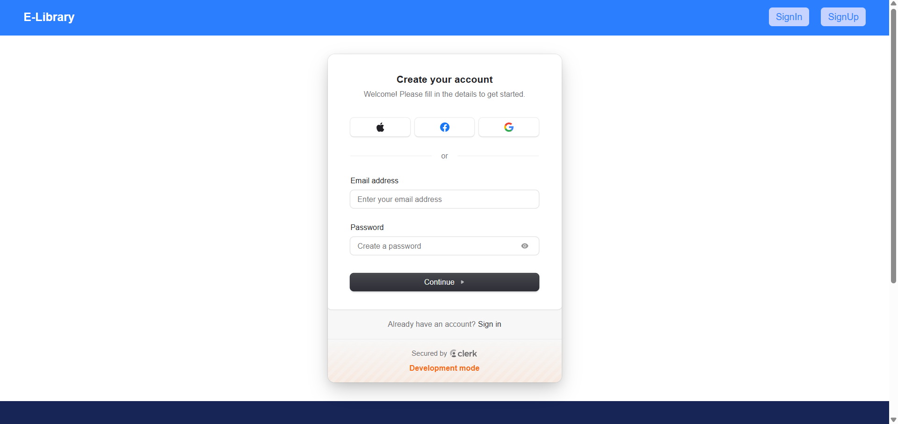

# 📚 E-Library

A full-stack digital library platform built using Next.js that allows users to upload, manage, and access PDF-based books through a clean and responsive interface.

## 🚀 Features

* 📖 Upload and manage PDF books
* 🔐 Authentication and role-based access
* 📂 Organized book management system
* ⚡ Fast and dynamic UI using Next.js App Router
* 📱 Fully responsive design

## 🛠️ Tech Stack

* **Frontend:** Next.js, React.js, Tailwind CSS
* **Backend:** Node.js, Next.js Server Actions / API Routes
* **Database:** MongoDB
* **File Uploads:** (e.g., **Cloudinary** / **Uploadcare**)

## 🌐 Live Demo

👉 [https://librixweb.vercel.app/](https://librixweb.vercel.app/)

## 📂 GitHub Repository

👉 [https://github.com/chinmay21/E-Library.git](https://github.com/chinmay21/E-Library.git)

## ⚙️ Installation & Setup

1. Clone the repository

```bash
git clone https://github.com/chinmay21/E-Library.git
cd E-Library
```

2. Install dependencies

```bash
npm install
```

3. Setup environment variables Create a `.env` file in the root directory and add:

```env
# -------------------------
# Clerk Authentication
# -------------------------
NEXT_PUBLIC_CLERK_PUBLISHABLE_KEY=your_clerk_publishable_key
CLERK_SECRET_KEY=your_clerk_secret_key

NEXT_PUBLIC_CLERK_SIGN_IN_URL=/sign-in
NEXT_PUBLIC_CLERK_SIGN_UP_URL=/sign-up

NEXT_PUBLIC_CLERK_SIGN_IN_FALLBACK_REDIRECT_URL=/dashboard
NEXT_PUBLIC_CLERK_SIGN_UP_FORCE_REDIRECT_URL=/onboarding


# -------------------------
# Cloudinary (File Uploads)
# -------------------------
CLOUDINARY_CLOUD_NAME=your_cloudinary_cloud_name
CLOUDINARY_API_KEY=your_cloudinary_api_key
CLOUDINARY_API_SECRET=your_cloudinary_api_secret


# -------------------------
# Database (MongoDB / PostgreSQL)
# -------------------------
DATABASE_URL=your_database_connection_string


# -------------------------
# Uploadcare (File Upload Alternative)
# -------------------------
NEXT_PUBLIC_UPLOADCARE_PUBLIC_KEY=your_uploadcare_public_key
UPLOADCARE_SECRET_KEY=your_uploadcare_secret_key
```

4. Run the development server

```bash
npm run dev
```

5. Open in browser

```
http://localhost:3000
```

## 📌 Project Highlights

* Built using **Next.js App Router** for modern routing and server-side capabilities
* Implemented **CRUD operations** for managing books
* Designed a **modular and scalable architecture**
* Ensured **smooth client-server interaction** using React and server actions

📷 Screenshots
🏠 Home Page



📊 Dashboard


📤 Upload Book


🔐 Sign In


📝 Sign Up


## 🤝 Contributing

Contributions are welcome! Feel free to fork the repo and submit a pull request.

## 📄 License

This project is open-source and available under the MIT License.

---

### 💡 Author

**Chinmay Dhaundiyal**

---

If you like this project, consider giving it a ⭐ on GitHub!

